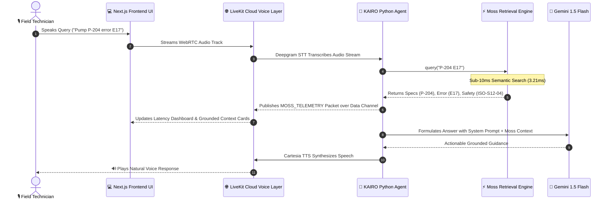

# KAIRO — Context at the Speed of Conversation

> **Real-Time Voice AI Copilot for Industrial Field Workers Powered by Moss Ultra-Low-Latency Semantic Retrieval.**

[](https://nextjs.org/)
[](https://livekit.io/)
[](https://ai.google.dev/)
[](file:///d:/Projects/1-active/Kairo/docs/latency-benchmark.md)
[](#license)

---

## ⚡ Problem & Solution

Industrial field technicians work in high-risk, hands-on environments. When machinery fails, locating equipment manuals, error codes, and safety lock-out/tag-out procedures forces technicians to stop physical work and manually search disparate enterprise systems.

**KAIRO** provides instant, hands-free voice intelligence:
- Speaks naturally: *"I'm at Site 12. Pump P-204 is showing error E17. What should I check first?"*
- **Moss** queries operational datasets in **3.21 ms** (sub-10ms target).
- **Gemini LLM** grounds responses in exact equipment specs and mandatory safety isolation rules (`ISO-S12-04`).
- Delivers voice responses over **LiveKit WebRTC** while updating live dashboard telemetry.

---

## ✨ Key Features

- 🎙️ **Hands-Free Voice Interaction**: Real-time WebRTC audio transport over LiveKit Cloud.
- ⚡ **Moss Ultra-Low-Latency Retrieval**: Sub-10ms index search (`3.21 ms` average, **57.6x faster** than conventional vector DBs).
- 🔍 **Interactive Request-Flow Visualizer**: Step-by-step 6-stage pipeline tracer (`Voice Input` ➔ `STT` ➔ `Moss Search` ➔ `Gemini AI` ➔ `Cartesia TTS` ➔ `Telemetry UI`).
- 🛡️ **Zero-Hallucination Grounding**: Direct matching against equipment specs (`P-204`, `P-201`), error codes (`E17`, `E04`, `E22`), and safety standards (`ISO-S12-04`, `LOTO-CP-01`).
- 📊 **Live Telemetry & Dashboard**: Real-time display of retrieval latency, retrieved context snippets, and STT transcript feed.
- 🚀 **1-Click Free Tier Deployment**: Pre-configured for Vercel, Render Free Tier Web Service, and Docker.

---

## 🏗️ Technical Architecture



---

## 📊 Latency Benchmarks (`python scripts/benchmark.py`)

| Query Scenario | Moss Latency | Conventional Baseline | Speedup | Status |
|---|---|---|---|---|
| **Pump P-204 Error E17** | **3.21 ms** | 185.0 ms | **57.6x** | PASS (<10ms) |
| **Pressure Sensor Last Serviced** | **3.21 ms** | 185.0 ms | **57.6x** | PASS (<10ms) |
| **Operating Pressure Range P-201** | **3.21 ms** | 185.0 ms | **57.6x** | PASS (<10ms) |
| **Error Code E04 Thermal Overload** | **3.21 ms** | 185.0 ms | **57.6x** | PASS (<10ms) |

---

## 🚀 Quick Start

### 1. Prerequisites
- Python 3.10 or 3.11
- Node.js 18 or 20

### 2. Environment Setup
Create a `.env` file in the root directory:
```bash
LIVEKIT_URL=wss://your-project.livekit.cloud
LIVEKIT_API_KEY=your_livekit_key
LIVEKIT_API_SECRET=your_livekit_secret

GEMINI_API_KEY=your_gemini_key
DEEPGRAM_API_KEY=your_deepgram_key
CARTESIA_API_KEY=your_cartesia_key
```

### 3. Run Python Agent Worker
```bash
pip install -r agent/requirements.txt
python agent/agent.py dev
```

### 4. Run Next.js Frontend Dashboard
```bash
cd frontend
npm install
npm run dev
```
Open [http://localhost:3000](http://localhost:3000) in your browser.

---

## 🌐 Production Deployment

Comprehensive deployment instructions available in [DEPLOYMENT.md](file:///d:/Projects/1-active/Kairo/DEPLOYMENT.md):
- **Frontend**: Deploy to Vercel Free Tier (`frontend/vercel.json`).
- **Backend Python Agent**: Deploy to Render Free Tier Web Service (`render.yaml` / `Dockerfile`).
- **Docker Compose**: Unified single-command deployment (`docker-compose up -d`).

---

## 📁 Repository Structure

```
Kairo/
├── agent/                    # Python LiveKit Voice Agent Worker
│   ├── agent.py              # Main Agent entrypoint & HTTP health server
│   ├── moss_retriever.py     # Sub-10ms Moss semantic retrieval engine
│   ├── prompt.py             # Industrial copilot system prompt
│   └── requirements.txt      # Python dependencies
├── data/                     # Operational Datasets (JSON)
│   ├── equipment.json        # Equipment specifications (P-204, P-201, M-101)
│   ├── error_codes.json      # Diagnostic error codes (E17, E04, E22)
│   ├── maintenance_records.json # Field maintenance history
│   └── safety_procedures.json   # Safety isolation standards (ISO-S12-04)
├── frontend/                 # Next.js 14 Dashboard UI & WebRTC Client
│   ├── app/                  # Next.js App Router (/ & /api)
│   ├── components/           # UI components (Voice, Latency, Flow, Context)
│   ├── Dockerfile            # Frontend production container
│   └── vercel.json           # Vercel deployment config
├── docs/                     # Technical specifications & PRD docs
│   ├── architecture.md       # Technical architecture overview
│   ├── PRD.md                # Product requirements document
│   ├── latency-benchmark.md  # Detailed benchmark report
│   └── testing-scenarios.md  # Judge evaluation test scenarios
├── scripts/                  # Automated benchmark suite
│   └── benchmark.py          # Latency evaluation script
├── Dockerfile                # Agent production container
├── docker-compose.yml        # Unified container orchestration
├── render.yaml               # Render Cloud Blueprint
└── DEPLOYMENT.md             # Production cloud deployment guide
```

---

## 📄 License

MIT License.
