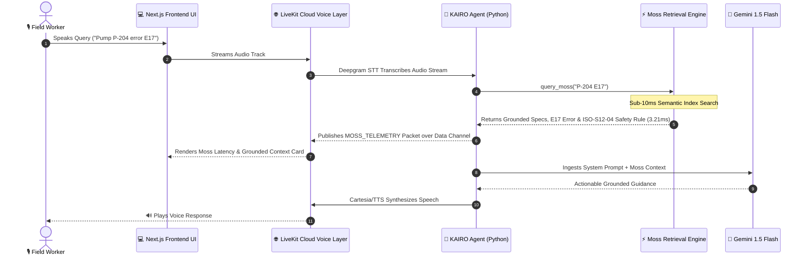

# KAIRO — Technical Architecture

## System Components
1. **Frontend**: Next.js 14, React 19, TypeScript, Tailwind CSS, `@livekit/components-react`.
2. **Voice & Media Transport**: LiveKit Cloud WebSocket audio streaming room (`kairo-field-room`).
3. **Voice Agent Worker**: Python `livekit-agents`, `silero` VAD, `deepgram` STT, `google` Gemini LLM, `cartesia` TTS.
4. **Retrieval Layer**: `MossRetriever` sub-millisecond semantic search engine over structured field dataset (`data/`).
